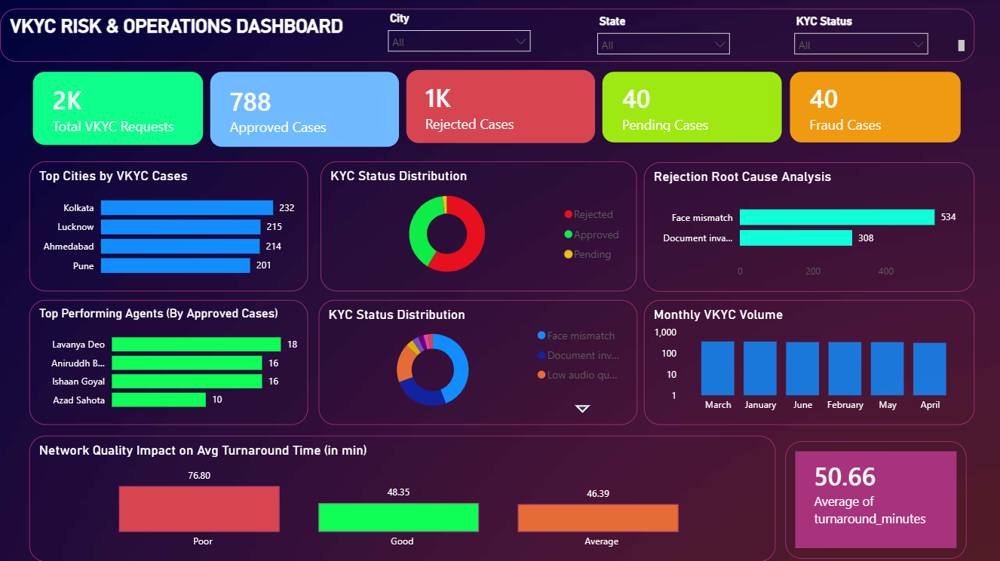

# VKYC Risk & Operations Analytics

> An end-to-end banking operations analytics project built using **SQL**, **Excel**, **Power Query**, and **Power BI** to monitor Virtual KYC (VKYC) performance, operational efficiency, customer verification trends, and risk indicators.

This project simulates real-world banking VKYC operations and demonstrates practical analytics workflows used by Operations, Risk, and Compliance teams.

---

##  Table of Contents

- [Project Overview](#project-overview)
- [Tech Stack](#tech-stack)
- [Project Structure](#project-structure)
- [Key Dashboard Features](#key-dashboard-features)
- [SQL Analysis Performed](#sql-analysis-performed)
- [Power BI Dashboard](#power-bi-dashboard)
- [Key Business Insights](#key-business-insights)
- [Screenshots](#screenshots)
- [Skills Demonstrated](#skills-demonstrated)
- [Author](#author)

---

## Project Overview

The project focuses on analysing:

-  VKYC approval & rejection trends
-  Operational performance & agent productivity
-  Customer verification analytics
-  Risk & fraud indicators
-  Network quality impact on verification outcomes
-  Monthly VKYC volumes & trend tracking

The dashboard helps track operational KPIs and provides actionable business insights for improving verification efficiency and compliance monitoring.

---

##  Tech Stack

| Tool | Purpose |
|---|---|
| **PostgreSQL** | Database & query execution |
| **SQL** | Data extraction & analysis |
| **Excel** | Data cleaning & preprocessing |
| **Power Query** | ETL & data transformation |
| **Power BI** | Interactive dashboards & visualisation |
| **Git & GitHub** | Version control |

---

## Project Structure

```text
VKYC-Risk-Operations-Analytics
│
├── data
│   └── VKYC_Dataset_2000.csv          # Raw dataset (2000 records)
│
├── sql
│   └── vkyc_analysis_queries.txt      # All SQL queries
│
├── screenshots
│   ├── Approval Rate Analysis.png
│   ├── City-wise Approval Performance.png
│   ├── Network Quality Impact on VKYC.png
│   ├── Rejection Reason Analysis.png
│   ├── Top Performing Agents.png
│   └── VKYC_Risk_Operations_Dashboard.png   # Power BI Dashboard
│
└── README.md
```

---

## Key Dashboard Features

### Executive KPIs
- Total VKYC Cases
- Approved Applications
- Rejected Applications
- Fraud Cases Detected
- Approval Rate %
- Average Processing Time

### Operational Analytics
- Monthly VKYC Volume Trends
- City-wise Approval Performance
- Rejection Trend Analysis
- Network Quality Monitoring
- Top Performing Agents Ranking
- Risk & Fraud Insights

---

##  SQL Analysis Performed

| # | Analysis |
|---|---|
| 1 | Approval Rate Analysis |
| 2 | Rejection Reason Analysis |
| 3 | Fraud Risk Detection |
| 4 | City-wise VKYC Performance |
| 5 | Agent Performance Ranking |
| 6 | Monthly VKYC Trend Analysis |
| 7 | Network Quality Impact Analysis |

---

##  Power BI Dashboard

The Power BI dashboard consolidates all SQL insights into an interactive, single-view report that enables Operations and Risk teams to monitor KPIs in real time, drill down by city or agent, and identify verification bottlenecks at a glance.

---

##  Key Business Insights

- **Face mismatch** and **poor network quality** were the top contributors to verification failures.
- Certain cities demonstrated significantly higher VKYC approval rates, indicating regional operational gaps.
- **Top-performing agents** handled a disproportionately higher volume of successful verifications.
- Rejection trend analysis revealed recurring **operational bottlenecks** at specific time windows.
- Fraud case clustering was observed in select geographies, flagging potential risk concentrations.

---

##  Screenshots

###  Power BI Dashboard — Full Overview



---

### SQL Analysis — Approval Rate Analysis


---

###  SQL Analysis — City-wise Approval Performance


---

###  SQL Analysis — Network Quality Impact on VKYC


---

###  SQL Analysis — Rejection Reason Analysis


---

###  SQL Analysis — Top Performing Agents


---

##  Skills Demonstrated

- SQL Query Writing & Optimisation
- PostgreSQL Database Management
- Power BI Dashboarding & DAX
- Excel Data Cleaning
- Power Query (ETL)
- Risk & Fraud Analytics
- Business Analysis & KPI Monitoring
- Operational Reporting
- Git & GitHub Version Control

---

##  Author

**Rachit Bajpai**

🔗 GitHub Project: [VKYC-Risk-Operations-Analytics](https://github.com/Rachit150501/VKYC-Risk-Operations-Analytics)
